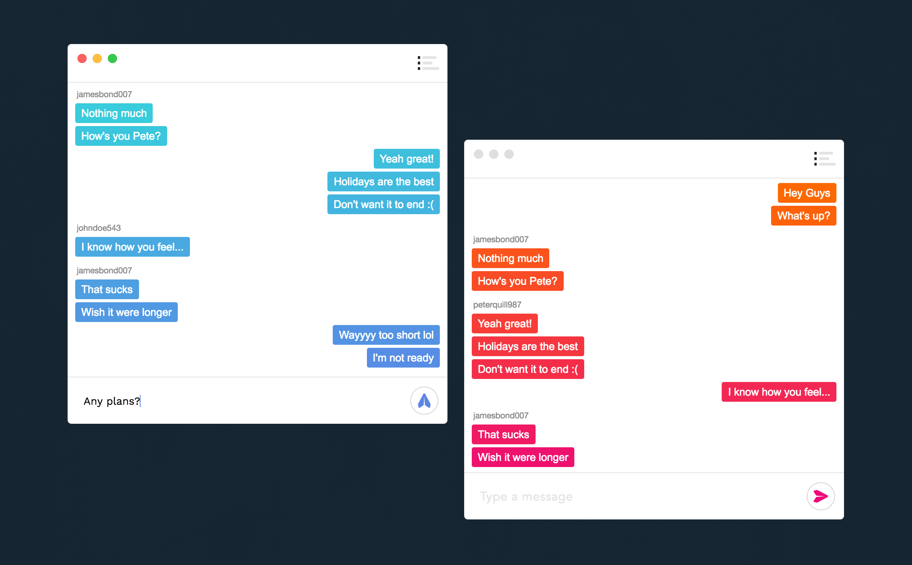

# TYP. Messenger (Prototype)

TYP. Messenger is an ultra sleek messaging platform.
Note: The official and updated repository is here: [TYP.](https://github.com/jdansev/TYP.) 



## Setup

**First clone this repo:**
```
git clone https://github.com/jdansev/TYP-Messenger
```

**Create and activate a new python virtual environment:**
```
virtuenenv env -p python3
source env/bin/activate
```

Install the dependencies listed in the requirements.txt file. Be sure to do this inside of a virtual environment if you want to keep this project's dependencies separate from your global ones. To do so run this:
```
pip3 install -r requirements.txt
```

**Install redis with homebrew and start it:**
```
brew install redis
redis-server
```

**Now fire up the server:**
```
python3 manage.py runserver
```

**Start a TYP. messenger:**
```
electron .
```

**Or instead package it as a standalone electron app:**
```
electron-packager . --overwrite --platform=darwin --arch=x64 --prune=true --out=release-builds
```

## Managing group chats

These APIs are used to manage groups without needing to go through Django's admin panel.

**List all groups:**
```
http://127.0.0.1:8000/groups/
```

**Delete all groups:**
```
http://127.0.0.1:8000/groups/delete
```

**Remove all users and groups**
```
python3 manage.py flush
```
